<div align="center">

<!-- MASTER PHASE 4 AUTHENTIC HEADER BANNER SVG -->


<br/><br/>

<!-- REAL TECHNICAL BADGES BAR -->
[](https://www.kali.org/)
[](https://www.gnu.org/software/bash/)
[](https://www.python.org/)
[](https://git-scm.com/)
[](https://www.docker.com/)

<br/>

<!-- VERIFIED SOCIAL & CONTACT BADGES -->
[](https://manishmodhvadiya.free.nf/?i=1)
[](https://www.linkedin.com/in/manish-modhvadiya-955219270/)
[](https://www.instagram.com/manish_modhvadiya99/)
[](mailto:maherekta444@gmail.com)

</div>

---

### 🛡️ System Credentials &amp; Profile Summary

```json
{
  "operator": "Manish Modhvadiya",
  "handle": "@ManishModhvadiya",
  "location": "Porbandar, Gujarat, India",
  "education": "Bachelor of Computer Applications (BCA)",
  "role": "Cybersecurity Engineer & Offensive Security Researcher",
  "specializations": [
    "Offensive Security Tool Development",
    "Network Reconnaissance & Vulnerability Assessment",
    "Digital Forensics & Cryptographic Steganography",
    "REST API Security & Secure Backend Architecture"
  ],
  "toolchain": ["Kali Linux", "VS Code", "Burp Suite", "Nmap", "Wireshark", "Docker", "Git"]
}
```

I am a **Cybersecurity Engineer**, **Offensive Security Researcher**, and **Software Developer**. I focus on building open-source security tools, auditing software perimeters, and developing secure applications using Python, Bash, TypeScript, and C.

---

### ⚙️ Technical Skills &amp; Toolchain

#### 💻 Core Programming Languages
[](https://www.python.org/)
[](https://www.typescriptlang.org/)
[](https://developer.mozilla.org/)
[](https://www.gnu.org/software/bash/)
[](https://en.cppreference.com/w/c)
[](https://www.php.net/)
[](https://www.postgresql.org/)

#### 🛡️ Cybersecurity &amp; Audit Toolchain
[](https://www.kali.org/)
[](https://portswigger.net/burp)
[](https://nmap.org/)
[](https://www.wireshark.org/)
[](https://developer.android.com/studio)
[](https://www.postman.com/)

#### ⚡ Frameworks, Backend &amp; Databases
[](https://fastapi.tiangolo.com/)
[](https://react.dev/)
[](https://tailwindcss.com/)
[](https://vitejs.dev/)
[](https://www.docker.com/)
[](https://www.sqlite.org/)
[](https://www.mysql.com/)
[](https://www.postgresql.org/)

---

### 🚀 Open-Source Security Projects

<table width="100%">
  <tr>
    <td width="50%" valign="top">
      <h4>🔐 1. StegShield — Secure Steganography Platform</h4>
      <p><b>Overview:</b> Python steganography tool leveraging AES-256 encryption and Least Significant Bit (LSB) image matrix manipulation to embed payloads inside image carriers.</p>
      <p><b>Tech Stack:</b> <code>Python</code> • <code>FastAPI</code> • <code>Pillow</code> • <code>AES-256</code></p>
      <a href="https://github.com/ManishModhvadiya/StegShield"><b>📁 Repository Link &rarr;</b></a>
    </td>
    <td width="50%" valign="top">
      <h4>🐉 2. KaliAssist CLI — Cybersecurity Toolkit</h4>
      <p><b>Overview:</b> Modular Linux CLI utility for automating port scans, inspecting HTTP headers, and simplifying reconnaissance tasks.</p>
      <p><b>Tech Stack:</b> <code>Python</code> • <code>Bash</code> • <code>Linux CLI</code> • <code>Nmap API</code></p>
      <a href="https://github.com/ManishModhvadiya/KaliAssist-CLI"><b>📁 Repository Link &rarr;</b></a>
    </td>
  </tr>
  <tr>
    <td width="50%" valign="top">
      <h4>📱 3. MaherSec — Android Cybersecurity Application</h4>
      <p><b>Overview:</b> Android mobile security audit application for examining APK permissions, static code risks, and dynamic network traffic.</p>
      <p><b>Tech Stack:</b> <code>Android</code> • <code>Java/Kotlin</code> • <code>Static Audit</code> • <code>REST API</code></p>
      <a href="https://github.com/ManishModhvadiya/MaherSec"><b>📁 Repository Link &rarr;</b></a>
    </td>
    <td width="50%" valign="top">
      <h4>🌐 4. Developer Portal</h4>
      <p><b>Overview:</b> Responsive developer platform UI offering API testing controls, key management interfaces, and backend service integration.</p>
      <p><b>Tech Stack:</b> <code>TypeScript</code> • <code>React</code> • <code>FastAPI</code> • <code>Tailwind CSS</code></p>
      <a href="https://github.com/ManishModhvadiya/Developer-Portal"><b>📁 Repository Link &rarr;</b></a>
    </td>
  </tr>
  <tr>
    <td colspan="2" valign="top">
      <h4>📊 5. Log Analysis Platform</h4>
      <p><b>Overview:</b> Log ingestion and analysis engine built to parse syslog streams, flag brute-force/SQLi patterns, and render event summaries.</p>
      <p><b>Tech Stack:</b> <code>Python</code> • <code>FastAPI</code> • <code>PostgreSQL</code> • <code>Docker</code></p>
      <a href="https://github.com/ManishModhvadiya/Log-Analysis-Platform"><b>📁 Repository Link &rarr;</b></a>
    </td>
  </tr>
</table>

---

### 📊 GitHub Activity &amp; Telemetry

> [!NOTE]
> *Stats configured for Vercel edge deployment to avoid GitHub public API rate limits. See [`VERCEL_STATS_GUIDE.md`](./VERCEL_STATS_GUIDE.md) for self-hosting instructions.*

<div align="center">
  
  
</div>

<br/>

<div align="center">
  
</div>

---

### 🐍 Contribution Activity Matrix

<div align="center">
  <picture>
    <source media="(prefers-color-scheme: dark)" srcset="https://raw.githubusercontent.com/ManishModhvadiya/ManishModhvadiya/output/github-contribution-grid-snake-dark.svg">
    <source media="(prefers-color-scheme: light)" srcset="https://raw.githubusercontent.com/ManishModhvadiya/ManishModhvadiya/output/github-contribution-grid-snake.svg">
    
  </picture>
</div>

*Automated daily via GitHub Actions workflow (`.github/workflows/snake.yml`)*

---

### 🎓 Education &amp; Achievements

- 🎓 **Education:** Bachelor of Computer Applications (BCA) graduate from Porbandar, Gujarat, India.
- 🛠️ **Security Tool Development:** Author of open-source tools `StegShield` (steganography) and `KaliAssist CLI` (reconnaissance).
- 🐧 **Linux Proficiency:** Experienced in Kali Linux, Linux shell scripting, system administration, and Docker containerization.

---

### 🤝 Connect &amp; Contact

<div align="center">

| Channel | Link | Location / Target |
| :--- | :--- | :--- |
| 🌐 **Portfolio Website** | [manishmodhvadiya.free.nf](https://manishmodhvadiya.free.nf/?i=1) | Portfolio Website |
| 💼 **LinkedIn Profile** | [linkedin.com/in/manish-modhvadiya](https://www.linkedin.com/in/manish-modhvadiya-955219270/) | Professional Network |
| 📸 **Instagram** | [@manish_modhvadiya99](https://www.instagram.com/manish_modhvadiya99/) | Social Updates |
| ✉️ **Direct Email** | [maherekta444@gmail.com](mailto:maherekta444@gmail.com) | Direct Contact |

</div>

<br/>

<div align="center">
  
</div>

<div align="center">
  <sub><code>MANISH MODHVADIYA • CYBERSECURITY ENGINEER</code></sub>
</div>
